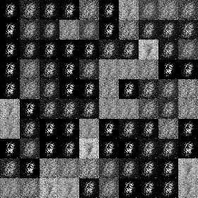
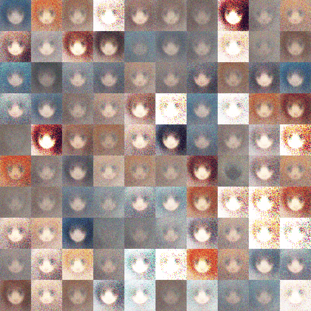

# Generative Adversarial Networks
Some gan implementations with pytorch.

# Installation
```shell
$ git clone https://github.com/baojunshan/gan.git
$ cd gan/
$ pip3 install -r requirements.txt
```

# Train Data
`./*gan/utils.py` contains `ImageLoader` class which can load train data. The input accepts incompressible pictures.
- mnist(png): [Baidu Cloud](https://pan.baidu.com/s/11ywkG7xRW_X97dqOt3stdQ) (password:ynz7)
- anime face(png): [Baidu Could](https://pan.baidu.com/s/1SSskYHea7SVioTc7NuCGRw) (password:nmj2)

> Usually, the data path should be like `./data/dataset_name/*.png`. Some labelled data path should be like `./data/dataset_name/label_name/*.png`. Otherwise, you can custom your `ImageLoader` to load data.

# Contents
Model | Paper | Code |
|:----|:----|:----|
|**Base**|||
|&emsp;&boxvr;&nbsp;GAN  |[\[2014.06\] Generative Adversarial Networks](https://arxiv.org/abs/1406.2661)|[Code](./gan)|
|&emsp;&boxvr;&nbsp;DCGAN|[\[2015.11\] Unsupervised Representation Learning with Deep Convolutional Generative Adversarial Networks](https://arxiv.org/abs/1511.06434)|[Code](./dcgan)|
|&emsp;&boxvr;&nbsp;LSGAN|[\[2016.11\]Least Squares Generative Adversarial Networks](https://arxiv.org/abs/1611.04076)|[Code](./lsgan)|
|&emsp;&boxvr;&nbsp;WGAN|[\[2017.01\] Wasserstein GAN](https://arxiv.org/abs/1701.07875)|[Code](./wgan)|
|&emsp;&boxvr;&nbsp;WGAN-gp|[\[2017.04\] Improved Training of Wasserstein GANs](https://arxiv.org/abs/1704.00028)|[Code](./wgan_gp)|
|&emsp;&boxvr;&nbsp;WGAN-div|[\[2017.12\]Wasserstein Divergence for GANs](https://arxiv.org/abs/1712.01026)|[Code](./wgan_div)|
|&emsp;&boxvr;&nbsp;SAGAN|||
|&emsp;&boxur;&nbsp;PGGAN|||
|**Conditional**|||
|&emsp;&boxvr;&nbsp;CGAN|[\[2014.11\] Conditional Generative Adversarial Nets](https://arxiv.org/abs/1411.1784)|[Code](./cgan)|
|&emsp;&boxvr;&nbsp;InfoGAN|||
|&emsp;&boxur;&nbsp;StyleGAN|||
|**Understanding**|||
|&emsp;&boxvr;&nbsp;CCGAN|||
|&emsp;&boxvr;&nbsp;Pix2Pix|||
|&emsp;&boxvr;&nbsp;CycleGAN|||
|&emsp;&boxur;&nbsp;SRGAN|||


# Implementations

### GAN
```shell
$ cd gan
$ sh run_mnist.sh
$ sh run_anime.sh
```
<center class="half">
    
</center>