# Generative Adversarial Networks
Some gan implementations with pytorch. Welcome to PR and issue.

# Installation
```shell
$ git clone https://github.com/baojunshan/gan.git
$ cd gan/
$ pip3 install -r requirements.txt
```

# Train Data
`./*gan/utils.py` contains `ImageLoader` class which can load train data. The input accepts incompressible pictures.
- mnist(png): [Baidu Cloud](https://pan.baidu.com/s/11ywkG7xRW_X97dqOt3stdQ) (password:ynz7)
- anime face(png): [Baidu Could](https://pan.baidu.com/s/1SSskYHea7SVioTc7NuCGRw) (password:nmj2)

> Usually, the data path should be like `./data/dataset_name/*.png`. Some labelled data path should be like `./data/dataset_name/label_name/*.png`. Otherwise, you can custom your `ImageLoader` to load data.

# Contents
Model | Paper | Code | Results |
|:----|:----|:----|:---|
|**Base**|||
|&emsp;&boxvr;&nbsp;GAN  |[\[2014.06\] Generative Adversarial Networks](https://arxiv.org/abs/1406.2661)|[Code](./gan)|[Results](https://github.com/baojunshan/gan#gan)|
|&emsp;&boxvr;&nbsp;DCGAN|[\[2015.11\] Unsupervised Representation Learning with Deep Convolutional Generative Adversarial Networks](https://arxiv.org/abs/1511.06434)|[Code](./dcgan)|[Results](https://github.com/baojunshan/gan#dcgan)|
|&emsp;&boxvr;&nbsp;LSGAN|[\[2016.11\]Least Squares Generative Adversarial Networks](https://arxiv.org/abs/1611.04076)|[Code](./lsgan)|[Results](https://github.com/baojunshan/gan#lsgan)|
|&emsp;&boxvr;&nbsp;WGAN|[\[2017.01\] Wasserstein GAN](https://arxiv.org/abs/1701.07875)|[Code](./wgan)|[Results](https://github.com/baojunshan/gan#wgan)|
|&emsp;&boxvr;&nbsp;WGAN-gp|[\[2017.04\] Improved Training of Wasserstein GANs](https://arxiv.org/abs/1704.00028)|[Code](./wgan_gp)|[Results](https://github.com/baojunshan/gan#wgan-gp)|
|&emsp;&boxvr;&nbsp;WGAN-div|[\[2017.12\]Wasserstein Divergence for GANs](https://arxiv.org/abs/1712.01026)|[Code](./wgan_div)|[Results](https://github.com/baojunshan/gan#wgan-div)|
|&emsp;&boxvr;&nbsp;SAGAN|[\[Self-Attention Generative Adversarial Networks\]](https://arxiv.org/abs/1805.08318)|[Code](./sagan)|[Results](https://github.com/baojunshan/gan#sagan)|
|&emsp;&boxur;&nbsp;PGGAN|||[Results](https://github.com/baojunshan/gan#pggan)|
|**Conditional**|||
|&emsp;&boxvr;&nbsp;CGAN|[\[2014.11\] Conditional Generative Adversarial Nets](https://arxiv.org/abs/1411.1784)|[Code](./cgan)|[Results](https://github.com/baojunshan/gan#cgan)|
|&emsp;&boxvr;&nbsp;InfoGAN|||[Results](https://github.com/baojunshan/gan#infogan)|
|&emsp;&boxur;&nbsp;StyleGAN|||[Results](https://github.com/baojunshan/gan#stylegan)|
|**Understanding**|||
|&emsp;&boxvr;&nbsp;CCGAN|||[Results](https://github.com/baojunshan/gan#ccgan)|
|&emsp;&boxvr;&nbsp;Pix2Pix|||[Results](https://github.com/baojunshan/gan#pix2pix)|
|&emsp;&boxvr;&nbsp;CycleGAN|||[Results](https://github.com/baojunshan/gan#cyclegan)|
|&emsp;&boxur;&nbsp;SRGAN|||[Results](https://github.com/baojunshan/gan#srgan)|


# Implementations

### GAN
```shell
$ cd gan
$ sh run_mnist.sh
$ sh run_anime.sh
```
<p float="left">
    
</p>

### DCGAN
```shell
$ cd dcgan
$ sh run_mnist.sh
$ sh run_anime.sh
```
<p float="left">
    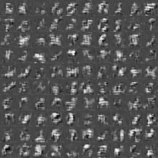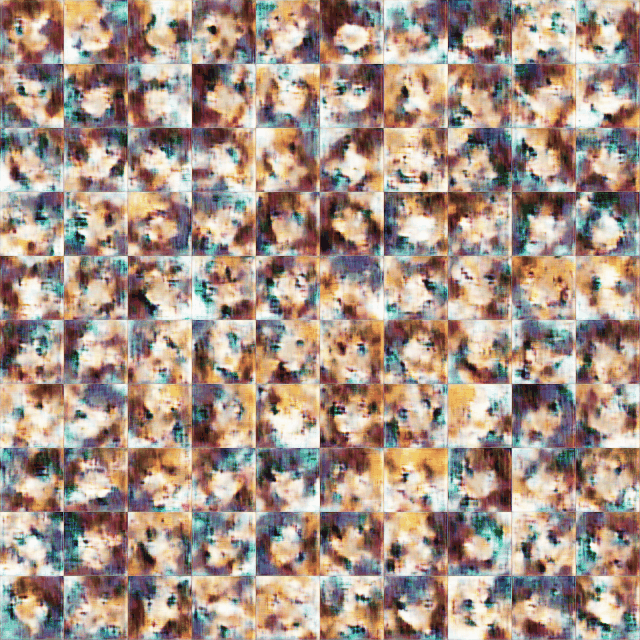
</p>

### LSGAN
```shell
$ cd lsgan
$ sh run_mnist.sh
$ sh run_anime.sh
```
<p float="left">
    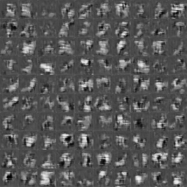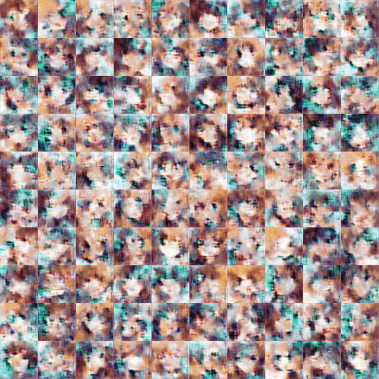
</p>


### WGAN
```shell
$ cd wgan
$ sh run_mnist.sh
$ sh run_anime.sh
```
<p float="left">
    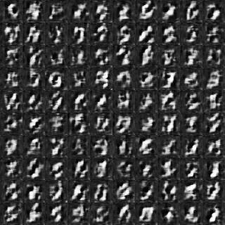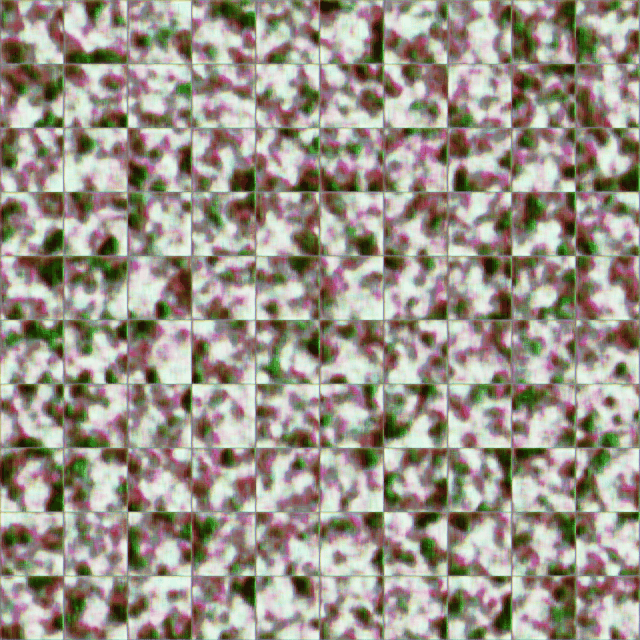
</p>

### WGAN-gp
```shell
$ cd wgan_gp
$ sh run_mnist.sh
$ sh run_anime.sh
```
<p float="left">
    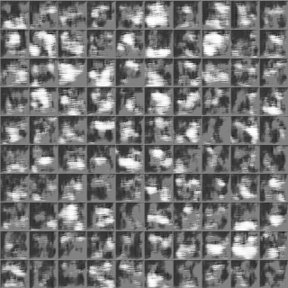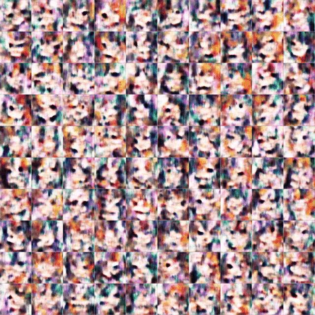
</p>

### WGAN-div
```shell
$ cd wgan_div
$ sh run_mnist.sh
$ sh run_anime.sh
```
<p float="left">
    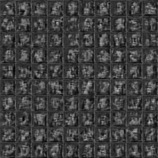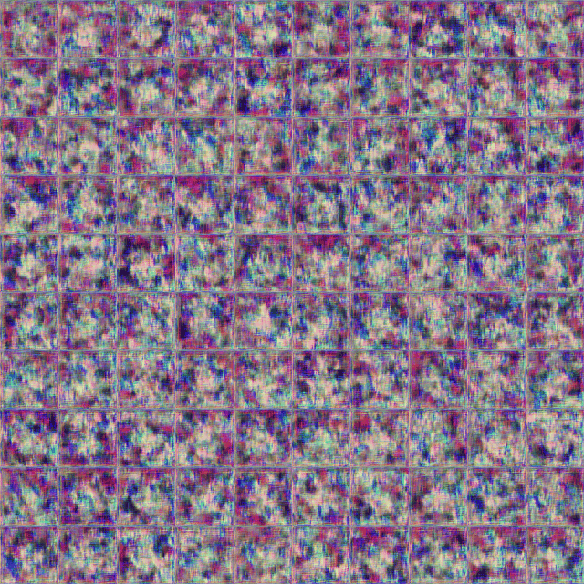
</p>

### SAGAN


### PGGAN


### CGAN
```shell
$ cd cgan
$ sh run_mnist.sh
```
<p float="left">
    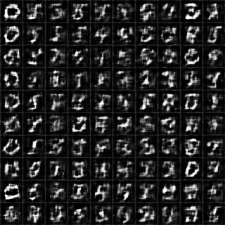
</p>

### InfoGAN


### StyleGAN


### CCGAN


### Pix2Pix


### CycleGAN


### SRGAN

